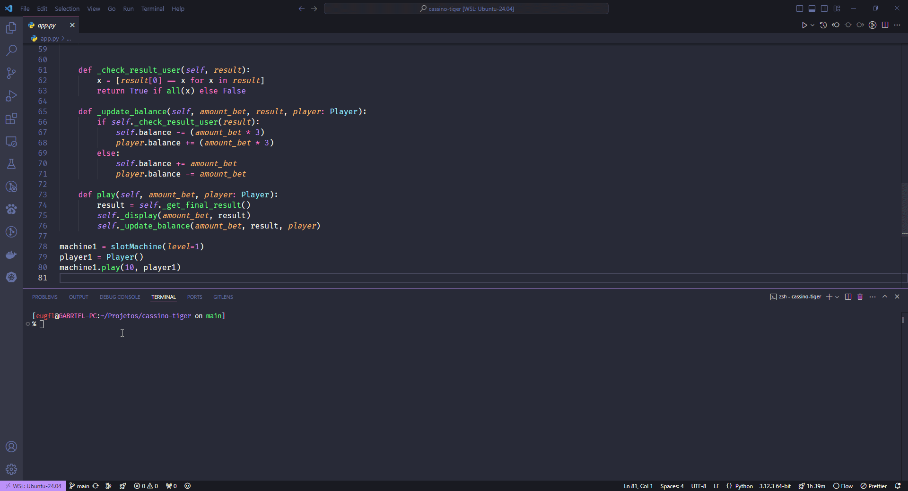

# Projeto: Máquina de Caça-Níquel

 

## Descrição

Este projeto simula uma **Máquina de Caça-Níquel (Slot Machine)** usando Python. O jogo permite que os jogadores façam apostas e rodem os símbolos, testando sua sorte para ver se conseguem combinar três símbolos iguais e ganhar prêmios. A máquina suporta diferentes níveis de dificuldade que afetam as combinações e as chances de ganhar.

## Funcionalidades

- Simulação de uma máquina de caça-níquel com rotação de símbolos.
- Exibição dos símbolos como emojis Unicode.
- Diferentes níveis de dificuldade que afetam as combinações e resultados.
- Controle de saldo tanto do jogador quanto da máquina.
- Sistema de apostas com cálculos automáticos de ganhos e perdas.

## Tecnologias Utilizadas

- Python 3.x
- Módulos:
  - `itertools`: Para gerar combinações de símbolos.
  - `random`: Para seleção aleatória dos resultados.
  - `os`: Para limpar o terminal (somente em ambientes Unix).
  - `time`: Para criar animações temporizadas durante a simulação.

## Como Rodar o Projeto

1. **Pré-requisitos**:
- Ter o Python 3.x instalado na sua máquina.

2. **Instalação**:
  - Clone o repositório em sua máquina local:
    `git clone https://github.com/eugfl/cassino-tiger.git`

  - Entre na pasta do projeto:
    `cd cassino-tiger`

  - Abra com o seu editor de código:
    `code .`
   
 - Ajuste as configurações no próprio código.

3. **Rodar**:
 - Execute o comando:
   `python3 app.py`

Feito com ♥ by [eugfl](https://www.linkedin.com/in/eugfl/)
